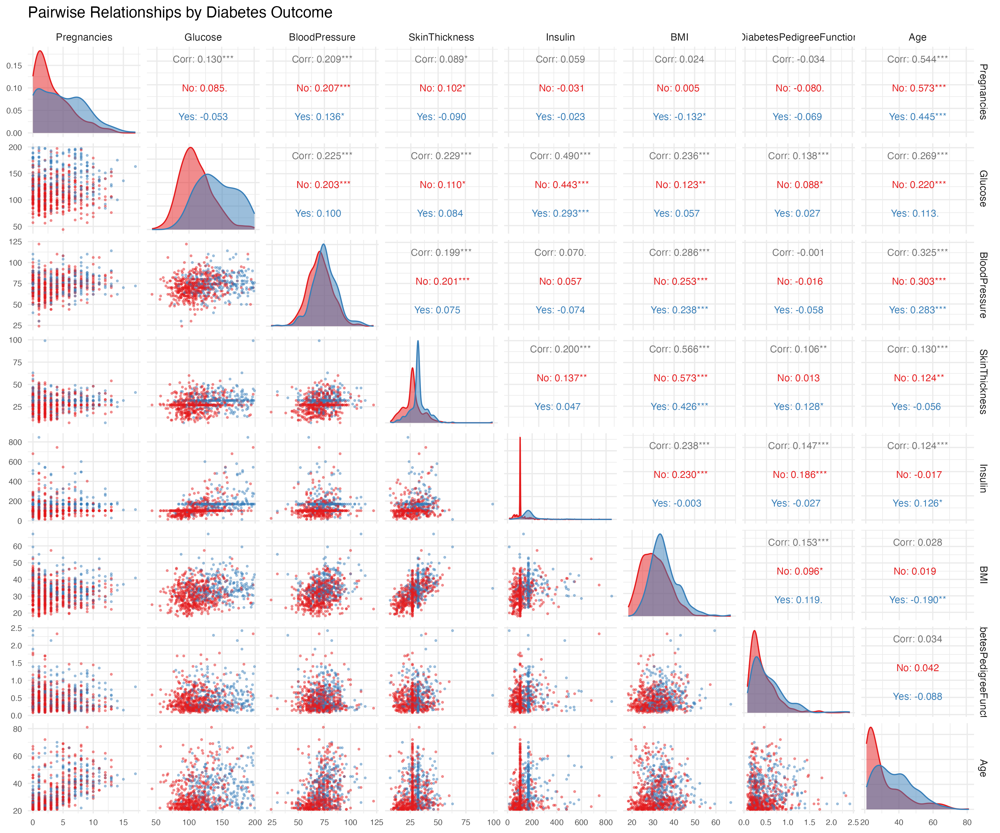
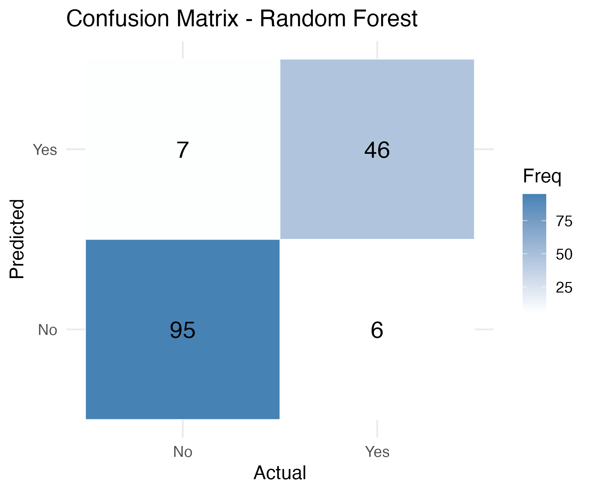

# Abstract Summary

This study investigates the use of machine learning techniques to predict diabetes status using clinical and demographic data from the Pima Indian Diabetes dataset. The dataset includes physiological variables such as glucose level, body mass index (BMI), age, and number of pregnancies.

A random forest classification model was developed to capture nonlinear relationships among predictors and improve prediction accuracy. The high recall indicates that the model is particularly effective at identifying individuals with diabetes, making it well-suited for screening and early detection applications.

Despite these promising results, the study has limitations. The dataset includes only female participants, which may restrict the generalizability of the model to broader populations. Overall, this analysis demonstrates that machine learning models, particularly ensemble methods like random forests, can effectively support diabetes risk prediction, though further validation across diverse populations is necessary before clinical implementation.

# Introduction

## Background Information

Diabetes is a chronic metabolic disease that affects millions of people worldwide, with significant health consequences if not properly managed [@spinelli2020]. Early detection of diabetes is critical for preventing complications such as cardiovascular disease, kidney dysfunction, nerve damage, and vision problems [@spinelli2020]. Women may face unique challenges related to diabetes, including an increased risk of pregnancy-related complications and a higher susceptibility to certain cancers [@berg2005].

Accurate prediction of diabetes using clinical and demographic data can help identify individuals at risk, enabling timely interventions and better management of the disease.

In this project, we aim to use statistical and machine learning methods to predict the presence of diabetes in individuals based on relevant clinical measurements and features from the dataset.

## Research Question

The question we will try to answer with this project is: "Can we predict the presence of diabetes in individuals based on clinical and demographic features?"

This question motivates a predictive analysis using clinical and demographic variables to classify whether an individual is likely to have diabetes.

We have framed our question based on previous studies that have shown certain clinical indicators, such as high blood glucose, BMI, age, and family history, are strongly associated with diabetes risk. For example, the Pima Indian study dataset has been widely used to develop predictive models for diabetes, highlighting the role of these risk factors in disease onset [@chang2022; @roumie2020].

## Dataset Used

The unprocessed dataset was acquired from the UCI Machine Learning Repository and is originally from the National Institute of Diabetes and Digestive and Kidney Diseases. The version used in this project was processed by a contributor on OpenML [@openml43483] and contains information on blood pressure, diabetes status, and other health-related variables of females. Based on the diagnostic measurements included in the dataset, the objective is to predict whether a patient has diabetes. The dataset was selected from a larger database using several constraints. Specifically, all patients are female, 21 years of age or older, and of Pima Indian heritage.

The dataset attributes are as follows:

-   Pregnancies: Number of pregnancies
-   Glucose: Blood glucose level
-   BloodPressure: Blood pressure measurement
-   SkinThickness: Skinfold thickness
-   Insulin: Blood insulin level
-   BMI: Body Mass Index
-   DiabetesPedigreeFunction: Diabetes pedigree function (a score indicating genetic predisposition)
-   Age: Age of the patient
-   Outcome: Final result (1 = diabetes, 0 = no diabetes)

## EDA

```{r}
#| include: false

library(tidyverse)
library(knitr)

df <- readRDS("../data/processed_data.rds")

n_obs <- nrow(df)
diabetes_rate <- mean(df$Outcome == "Yes", na.rm = TRUE) * 100
```

```{r}
#| label: tbl-head
#| tbl-cap: "First six rows of the diabetes dataset."

head(df)
```

@tbl-head: `df` the entire dataset, having 9 variables.

The df is already very clean with no missing values as shown below.

```{r}
na_counts <- colSums(is.na(as.data.frame(df)))
na_counts

cols <- c("Glucose", "BloodPressure", "SkinThickness", "Insulin", "BMI")
sapply(df[, cols, drop = FALSE], function(x) any(x == 0))
```

```{r}
#| label: tbl-summary
#| tbl-cap: "Baseline characteristics of participants in the diabetes dataset."

summary(df)
```

@tbl-summary presents the baseline characteristics of participants included in the diabetes dataset, presented as minimum, 1st quartile, median, mean, 3rd quartile, and maximum values for each variable.

Dataset Overview:
- Total observations: `r n_obs`
- Target variable: Outcome
- Proportion of patients with diabetes: `r round(diabetes_rate, 1)`%

About `r round(diabetes_rate, 1)`% of the patients in the dataset are labeled as having diabetes.

A potential challenge in this dataset is class imbalance. Approximately 35% of observations are labeled as diabetic, while the remaining 65% are labeled as non-diabetic. Because of this imbalance, accuracy alone is not enough to assess model performance. For that reason, we also report precision, recall, and F1 score, which provide a better picture of how well the model identifies the minority diabetic class.

```{r}
#| label: fig-pairplot
#| fig-cap: "Pairwise relationships between predictors and diabetes outcome."


```

@fig-pairplot shows the pairwise relationships between predictors and diabetes outcome.

@fig-pairplot: Matrix of scatter plots (lower panel), density plots (diagonal), and correlation coefficients (upper panel) for the eight predictor variables in the Pima Indian Diabetes dataset. Points are color-coded by diabetes status (blue = No diabetes, red = Diabetes), with overlaid density curves showing the distribution of each variable for the two outcome groups.

The pair plot reveals that glucose concentration has the strongest association with diabetes outcome (r = 0.53, p \< 0.001), followed by BMI (r = 0.29, p \< 0.001), age (r = 0.27, p \< 0.001), and number of pregnancies (r = 0.22, p \< 0.001), while other variables such as insulin, skin thickness, blood pressure, and diabetes pedigree function show weaker but still statistically significant correlations. Notable inter-feature relationships include strong positive correlations between age and pregnancies (r = 0.54) and between BMI and skin thickness (r = 0.54), as well as moderate correlations among insulin, glucose, and BMI, indicating expected physiological links. The density plots along the diagonal further show that individuals with diabetes tend to have higher glucose levels, greater BMI, and are older compared to those without diabetes.

# Methods & Results

To predict diabetes status, we performed a supervised classification analysis using a random forest model in R [@rcore2019]. And the following R packages were used to perform the analysis: knitr [@xie2014], tidyverse [@wickham2017], and Quarto [@quarto2022].

First, the dataset was imported into R as a data frame. The outcome variable representing diabetes status was converted to a factor to ensure that the task was treated as a classification problem rather than regression. All predictor variables were retained as features for model training.

The dataset was then partitioned into training and testing subsets using an 80/20 split. Stratified sampling was applied to preserve the class distribution of the diabetes outcome variable in both subsets. This ensured that the model was trained and evaluated on representative data.

A random forest classifier was trained using the training dataset. The model was fit using 500 decision trees, and the number of variables randomly sampled at each split was set to the default value (the square root of the number of predictors). Random forest was selected because it is robust to nonlinear relationships, automatically captures interactions between variables, and is less prone to overfitting compared to a single decision tree.

After training, the fitted model was used to generate predictions on the held-out test dataset. These predictions were compared against the true diabetes labels to evaluate model performance.

Model performance was assessed using a confusion matrix. From the confusion matrix, several evaluation metrics were calculated, including:

-   Accuracy, representing the proportion of correctly classified observations.
-   Precision, measuring the proportion of predicted positive cases that were truly positive.
-   Recall (sensitivity), measuring the proportion of actual positive cases correctly identified.
-   F1 score, representing the harmonic mean of precision and recall.

The confusion matrix was visualized as a heatmap to provide a graphical summary of classification performance. Additionally, a summary table was created to report the accuracy, precision, recall, and F1 score of the model.

All analyses were conducted in R using the randomForest and caret packages.

```{r}
#| label: fig-confusion
#| fig-cap: "Confusion matrix for the random forest model."

```

@fig-confusion shows the confusion matrix for the random forest model predicting diabetes status on the test dataset. The matrix shows the number of true positives, true negatives, false positives, and false negatives, comparing predicted classifications to the actual outcomes.

```{r}
#| label: tbl-metrics
#| tbl-cap: "Performance metrics for the random forest model predicting diabetes on the test dataset."

metrics_table <- read.csv("../results/final_results.csv")

accuracy  <- metrics_table$Value[metrics_table$Metric == "Accuracy"]
precision <- metrics_table$Value[metrics_table$Metric == "Precision"]
recall    <- metrics_table$Value[metrics_table$Metric == "Recall"]
f1        <- metrics_table$Value[metrics_table$Metric == "F1 Score"]

knitr::kable(metrics_table, digits = 3)
```

@tbl-metrics is performance metrics for the random forest model predicting diabetes on the test dataset, including accuracy, precision, recall, and F1 score

The model performed well on the held-out test set, with an accuracy of `r round(accuracy * 100, 1)`%, precision of `r round(precision * 100, 1)`%, recall of `r round(recall * 100, 1)`%, and an F1 score of `r round(f1 * 100, 1)`%. The high recall suggests that the model identified most diabetes cases in this particular test split, which is valuable in a screening-oriented setting where missed positive cases are especially concerning. The precision and F1 score also suggest a reasonably strong balance between identifying true diabetes cases and limiting false positives. However, these results should be interpreted as performance on this dataset and test split, rather than as evidence that the model would perform equally well in broader clinical settings.

# Discussion

## Interpretation of Findings

In this analysis, we developed a random forest classification model to predict diabetes status using clinical and physiological predictors. On the held-out test set, the model achieved an accuracy of `r round(accuracy * 100, 1)`%, precision of `r round(precision * 100, 1)`%, recall of `r round(recall * 100, 1)`%, and an F1 score of `r round(f1 * 100, 1)`%. These results suggest that the model performed well on this dataset, especially in terms of recall, meaning that it identified most of the diabetes cases in the test set.

This pattern is consistent with what we might expect from a random forest model applied to structured clinical data. Random forests can capture nonlinear relationships and interactions among variables without requiring strong parametric assumptions. The results also align with the exploratory analysis, where glucose, BMI, age, and pregnancies appeared to be among the most informative variables associated with diabetes status.

From a practical perspective, a model with relatively high recall may be useful in a screening context, where missing true diabetes cases is more concerning than flagging some false positives. However, this model should be understood as a predictive support tool rather than a clinical diagnostic tool. The findings show that the model can separate classes reasonably well within this dataset, but they do not establish causation and do not guarantee the same level of performance in other populations or settings.

## Limitations

This analysis has several limitations. First, the dataset includes only female participants of Pima Indian heritage aged 21 years or older, which limits how well the model may generalize to males, younger individuals, or other populations. Although the model performed well on this dataset, its performance in broader or more diverse populations remains unknown.

Second, the model was evaluated using a single 80/20 train-test split. This means the reported performance metrics depend on one particular partition of the data and may vary if a different split were used. As a result, the current evaluation provides useful evidence of predictive performance, but it should not be treated as a definitive estimate of how the model would perform in general.

Third, the dataset shows class imbalance, with fewer diabetes cases than non-diabetes cases. For this reason, we reported precision, recall, and F1 score in addition to accuracy. These metrics help provide a more balanced assessment of performance, especially for the minority diabetic class. However, we did not implement additional imbalance-handling methods such as class weighting, resampling, or threshold tuning, so this remains an area for improvement.

A final limitation is that the analysis does not include external validation. The model was tested only on held-out observations from the same overall dataset, rather than on a separate dataset collected from another source. Because of this, the results should be interpreted cautiously and should not be taken as evidence of readiness for clinical implementation.

## Future Work

Several next steps could strengthen this analysis. One improvement would be to evaluate the model using repeated resampling or cross-validation to obtain a more stable estimate of predictive performance. Another would be to compare the random forest model with additional approaches such as logistic regression, gradient boosting, or other ensemble methods.

Future work could also directly address class imbalance through methods such as resampling, class weights, or alternative decision thresholds. In addition, external validation on a different diabetes dataset would be important for understanding whether the model generalizes beyond the current sample.

Finally, interpretability methods such as variable importance measures or SHAP-style explanations could help clarify which predictors most strongly influence model decisions, making the results easier to understand in a healthcare setting.

## Conclusion

Overall, this study shows that machine learning methods, particularly a random forest classifier, can predict diabetes status reasonably well within this dataset using clinical and demographic variables. The model achieved strong test-set performance, especially in recall, suggesting potential value for identifying individuals at elevated risk. At the same time, the results are limited by the restricted study population, class imbalance, the use of a single train-test split, and the absence of external validation. For these reasons, the model should be viewed as a promising predictive exercise rather than a clinically deployable tool.

# References
